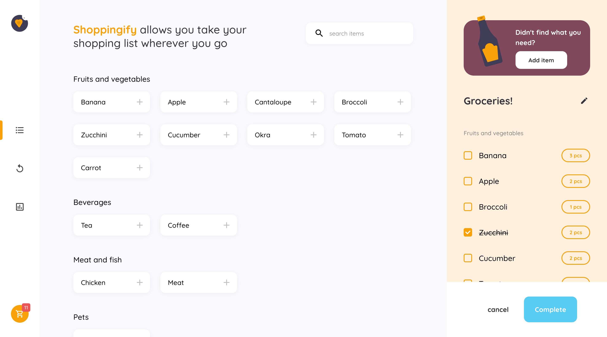
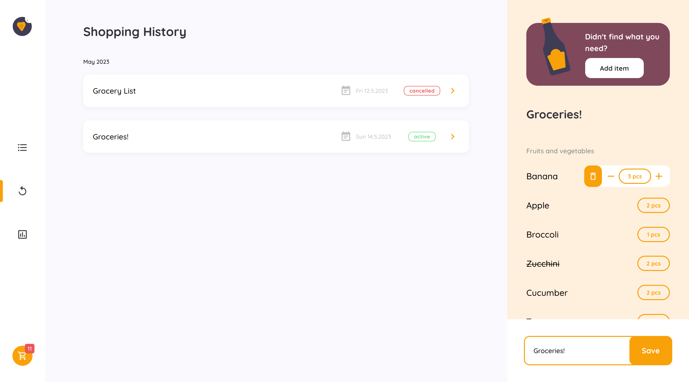
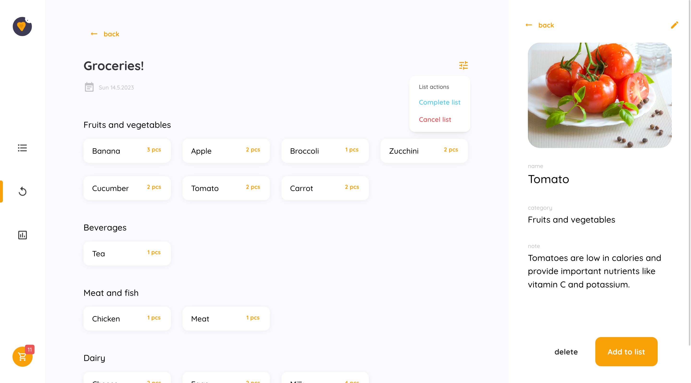
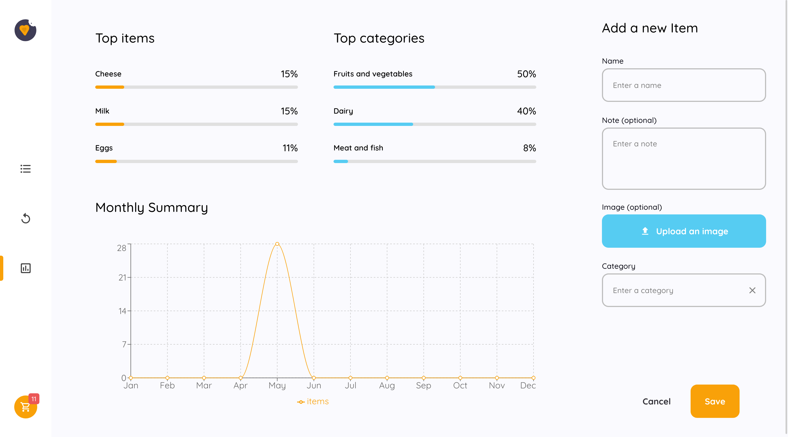

<h1 align="center">Shoppingify</h1>

   Solution for a challenge from  <a href="http://devchallenges.io" target="_blank">Devchallenges.io</a>.

  <h3>
    <a href="https://shoppingify-ayakh99.vercel.app/">
      Demo
    </a>
     | 
    <a href="https://github.com/ayakh99/shoppingify">
      Solution
    </a>
     | 
    <a href="https://devchallenges.io/challenges/mGd5VpbO4JnzU6I9l96x">
      Challenge
    </a>
  </h3>

<!-- TABLE OF CONTENTS -->

## Table of Contents

- [Overview](#overview)
  - [Built With](#built-with)
- [Features](#features)

<!-- OVERVIEW -->

## Overview

|                                |                                          |
| ------------------------------ | ---------------------------------------- |
| Items  | History        |
| List    | Statistics  |

### Built With

- [Next.js 13](https://nextjs.org/)
- [Mantine](https://mantine.dev/)
- [NextAuth.js](https://next-auth.js.org/)
- [Prisma](https://www.prisma.io/)
- [MongoDB](https://www.mongodb.com/)
- [Cloudinary](https://cloudinary.com/)

## Features

Users can:

- create an account or sign in using their Google account
- update their account info including name, profile picture, email, and password
- create and edit shopping lists
- cancel a list or mark it as complete
- toggle the editing state of a list again after it has been cancelled or completed
- have more than one shopping list active at a time and switch between editing them
- create items with a name, category, note, and image
- create new categories for items
- select an item and view its details
- update or delete items
- add or remove items from the currently active list
- increase or decrease the quantity of an item in the active list
- mark items as complete in the active list
- search for items by name
- view their shopping history
- view the details of all their lists including list title, items, and quantities
- view statistics including top items, top categories, and a chart for a monthly comparison
